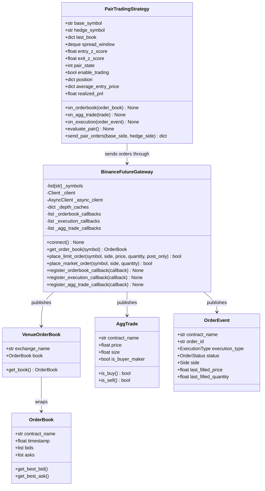
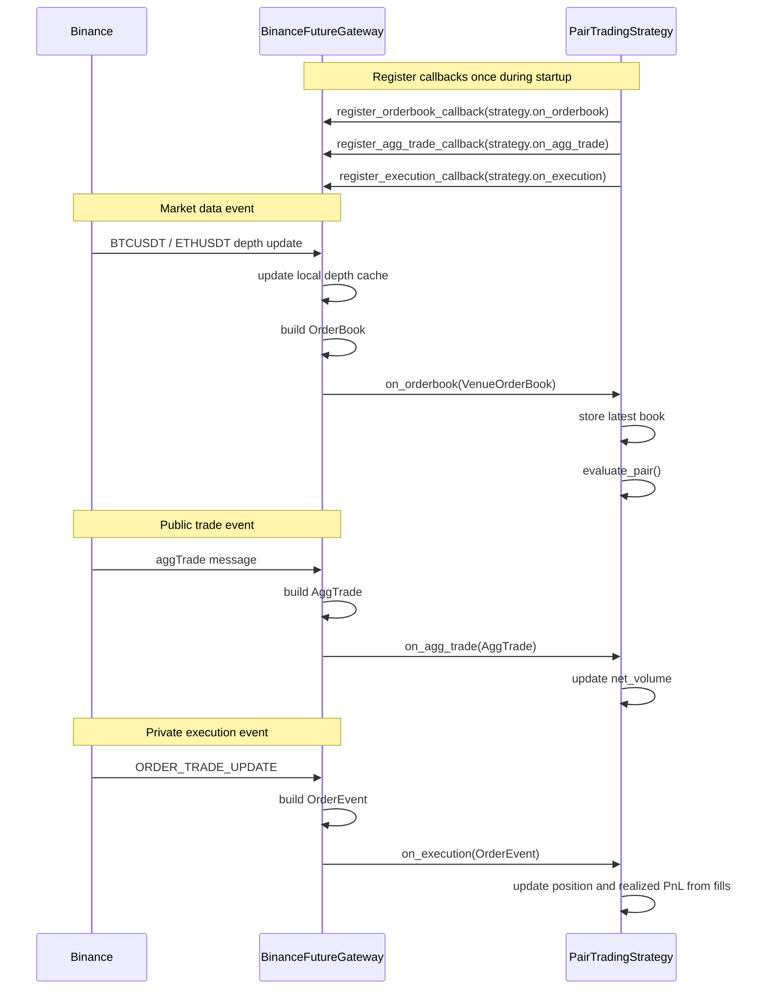
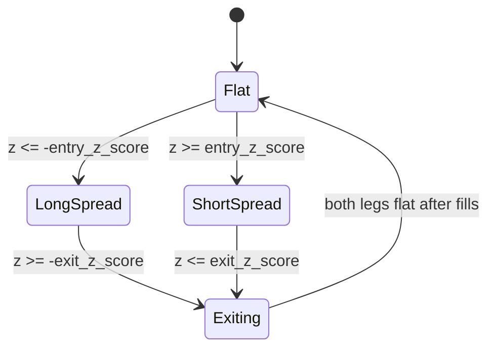
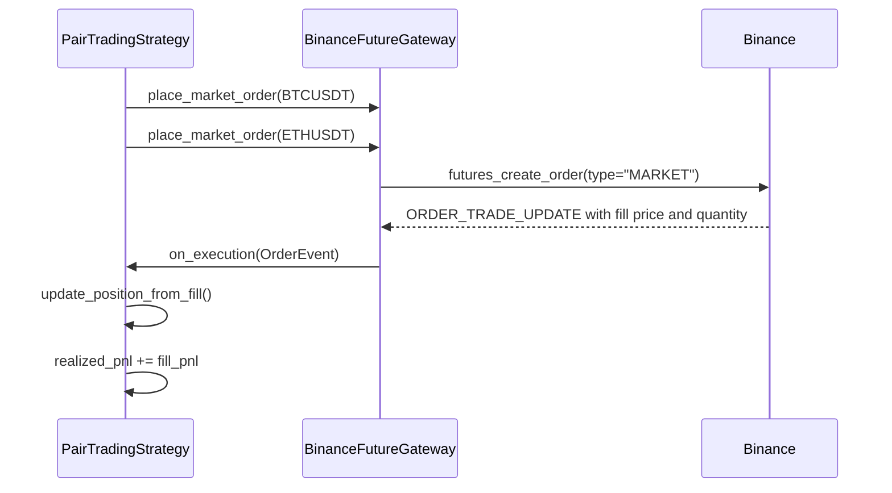

# Week 06: Event-Driven Pair Trading

This week builds from raw Binance Futures websocket streams into an event-driven
gateway and a BTC/ETH pair trading strategy.

The final example is:

- `7_pair_trading_ans.py`

It subscribes to `BTCUSDT` and `ETHUSDT`, maintains the latest order book for
each symbol, computes a rolling log-price spread, and sends pair entry/exit
orders when the spread z-score crosses strategy thresholds.

## Main Classes

Plain-text version for IntelliJ Markdown preview:

```text
BinanceFutureGateway
    owns Binance REST + websocket clients
    owns callback lists
    publishes VenueOrderBook, AggTrade, and OrderEvent
    sends market and limit orders

PairTradingStrategy
    registers callback methods with the gateway
    stores latest BTCUSDT and ETHUSDT books
    calculates spread z-score
    sends pair entry/exit orders through the gateway
    tracks position and PnL from execution fills

Shared event objects
    VenueOrderBook -> wraps OrderBook with exchange name
    OrderBook      -> best bid/ask and depth levels
    AggTrade       -> public trade with contract_name
    OrderEvent     -> private order/fill update
```

Mermaid version for renderers that support it:



## Callback Design

The gateway owns the Binance connections. The strategy does not read directly
from Binance. Instead, the strategy registers callback methods with the gateway:

```python
gateway.register_orderbook_callback(strategy.on_orderbook)
gateway.register_execution_callback(strategy.on_execution)
gateway.register_agg_trade_callback(strategy.on_agg_trade)
```

When a websocket message arrives, the gateway converts the raw Binance message
into a course-level event object, then calls every registered callback.

Plain-text version for IntelliJ Markdown preview:

```text
Startup
-------
PairTradingStrategy                  BinanceFutureGateway
        |                                      |
        | register_orderbook_callback(...)     |
        | register_agg_trade_callback(...)     |
        | register_execution_callback(...)     |
        |                                      |

Order book update
-----------------
Binance Futures -> BinanceFutureGateway -> PairTradingStrategy
 depth update       build OrderBook         on_orderbook(...)
                    wrap VenueOrderBook     store latest book
                                            evaluate_pair()

Agg trade update
----------------
Binance Futures -> BinanceFutureGateway -> PairTradingStrategy
 aggTrade          build AggTrade           on_agg_trade(...)
                                            update net_volume

Execution update
----------------
Binance Futures -> BinanceFutureGateway -> PairTradingStrategy
 ORDER_TRADE_      build OrderEvent         on_execution(...)
 UPDATE                                     update position
                                            update realized PnL
```

Mermaid version for renderers that support it:



## Pair Trading Flow

The pair strategy waits until it has both BTCUSDT and ETHUSDT books. On each
book update it calculates mid prices:

```python
base_mid = (btc_best_bid + btc_best_ask) / 2
hedge_mid = (eth_best_bid + eth_best_ask) / 2
```

Then it calculates a rolling spread:

```python
spread = log(base_mid) - hedge_ratio * log(hedge_mid)
```

Once the spread window is full, the strategy calculates a z-score:

```python
z_score = (spread - mean) / standard_deviation
```

The strategy state machine is:



Where:

- `LongSpread` means buy BTCUSDT and sell ETHUSDT.
- `ShortSpread` means sell BTCUSDT and buy ETHUSDT.
- `Exiting` means exit orders have been sent and the strategy is waiting for
  execution fills.

## PnL Callback

PnL is not calculated from submitted order prices. It is calculated from actual
execution fills received in `on_execution`.



After both legs are flat on exit, the strategy logs:

```text
EXIT PNL from actual fills | trade=... cumulative=...
TOTAL PNL = ...
```

## Important Safety Notes

- `USE_TESTNET = True` sends orders to Binance Futures testnet.
- `ENABLE_TRADING = True` allows the strategy to submit orders.
- For live market data without order submission, use `USE_TESTNET = False` and
  `ENABLE_TRADING = False`.
- This teaching version does not tag orders with custom client IDs yet, so a
  production version should filter execution events to only count fills created
  by this strategy.
